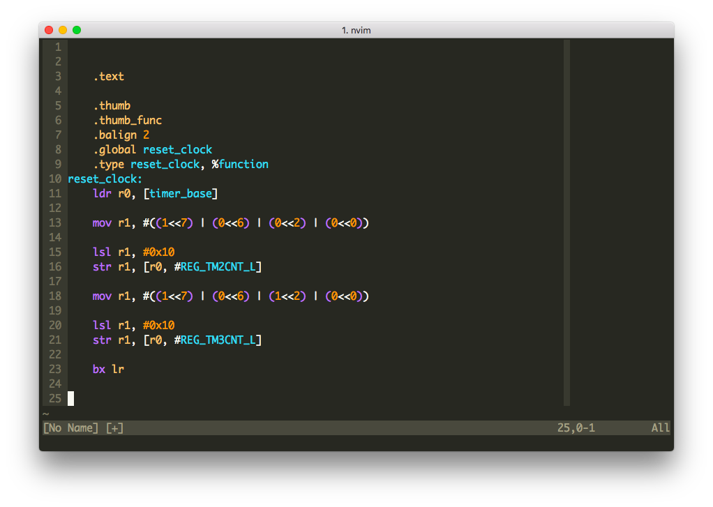

# arm-syntax-vim

GNU ARM assembly syntax highlighting (up to v7), for the vim text editor.



### Installation
Copy the [syntax](syntax) folder into your ~/.vim folder

__with Plug__
```
Plug 'ARM9/arm-syntax-vim'
```
__or with Pathogen__

Clone this repo into your ~/.vim/bundle directory.
```
git clone https://github.com/ARM9/arm-syntax-vim.git
```

### Using
In your .vimrc:
```
au BufNewFile,BufRead *.s,*.S set filetype=arm " arm = armv6/7
```
or add this line at the top or bottom of your assembly file(s):
```
@ vim:ft=armv5
```

